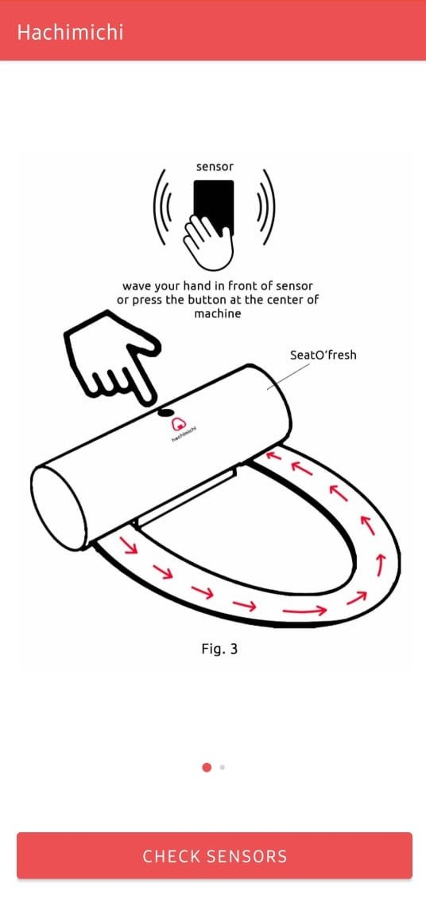
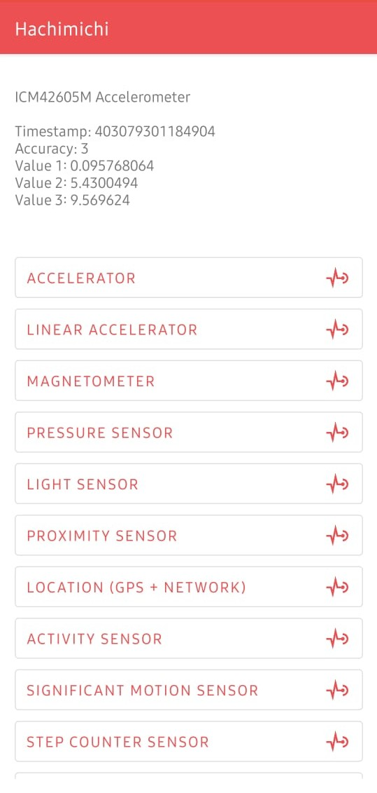

# Hachimichi

## Client

- The client uses MVVM as architecture.
- Events are transported using EventBus(Pub/Sub)
- Most of the Sensors have been added

 &nbsp;&nbsp; 

### Technologies Used:
- Firebase Storage and Authentication(Dummy User) Client Library
- Glide
- Event Bus
- Android Sensor API's
- Google Services(Location for FusedLocation)
- JUnit (for Tests)

### UI
- Material Design

## Server
- Firebase (Storage and Auth)

**Future Improvements**
- Storing images locally for minimzing network calls and save money(Which firebase charges)
- More tests can be written
- Event Bus use can be increased making things smooth. (Minimizes Hacky Solutions)

